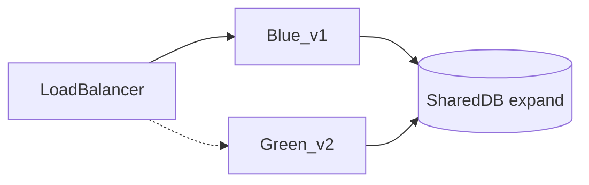

# Phase 15 — Blue-green deployment & tenant versioning

> **Теория:** [guides/phase-15-blue-green-theory.md](./guides/phase-15-blue-green-theory.md) — статус: placeholder  
> **Backend:** B-28 — gateway routing, admin commands  
> **Admin UI v2:** [admin-panel-spec.md](./admin-panel-spec.md)

**Длительность:** 36–39 недели (50–70 ч)  
**Предусловия:** Phase 14, infrastructure access (staging)  
**Цель:** Zero-downtime deploys, tenant pinned to versions, safe DB migrations.

---

## Результат фазы

- [ ] Blue/green environments documented + scripted
- [ ] Traffic switch runbook
- [ ] Expand/contract DB migrations
- [ ] Per-tenant version routing (canary)
- [ ] Automated smoke gate before switch
- [ ] Rollback drill completed once

---

## Неделя 1 — Concepts & architecture

### 15.1.1 Diagram

**Файл:** `docs/blue-green-architecture.mmd`



### 15.1.2 Components

| Component | Blue | Green |
|-----------|------|-------|
| Shell app | v1.0 | v1.1 |
| todos-mfe | v2.0 | v2.1 |
| API | v1 | v2 |
| DB schema | v10 | v10 + expand |

### 15.1.3 Tenant pinning

```json
{
  "tenant_acme": { "track": "green", "appVersion": "1.1" },
  "tenant_beta": { "track": "blue", "appVersion": "1.0" }
}
```

Routing: API gateway reads tenant → upstream cluster.

---

## Неделя 2 — Database migrations (expand/contract)

### 15.2.1 Expand phase (compatible with blue)

Example: add nullable column `priority` to todos.

- Blue app ignores column.
- Green app writes column.
- Both work on same DB.

### 15.2.2 Contract phase (after green 100%)

- Remove old column usage.
- Drop deprecated column in separate migration.

### 15.2.3 Migration tooling

| Tool | Use |
|------|-----|
| Flyway | SQL migrations versioned |
| Liquibase | alternative |

**Repo:** `backend/migrations/V11__add_todo_priority.sql`

### 15.2.4 Per-tenant migrations

If DB-per-tenant: migration job iterates tenants with lock.

### 15.2.5 Rollback

- Forward-only migrations preferred.
- Rollback = deploy blue + feature flag off new column.

---

## Неделя 3 — Deployment automation

### 15.3.1 Deploy green (no traffic)

1. Deploy API green (0% traffic).
2. Deploy shell + mfe green to green URLs.
3. Run migrations expand on DB.

### 15.3.2 Smoke tests gate

```bash
./scripts/smoke-green.sh
# hit green internal URL
# POST login, GET todos, health
```

Exit code ≠ 0 → abort switch.

### 15.3.3 Traffic switch

- LB weight 0→100 over 10 min OR instant flip for staging drill.
- Update `mf-manifest.json` CDN pointer.

### 15.3.4 Canary tenants

Move `tenant_beta` to green first; monitor 24h; then `tenant_acme`.

---

## Неделя 4 — Admin panel v2 (blue/green + migrations)

См. [admin-panel-spec.md](./admin-panel-spec.md):

- [ ] Blue/Green switch UI per tenant (confirm + audit log)
- [ ] Migration runner: version → preview → execute → progress
- [ ] Bulk migrate checkbox selection
- [ ] Deployment overview dashboard
- [ ] SignalR `MigrationProgressHub` subscription (backend B-12)
- [ ] E2E: switch tenant to green → verify routing

---

## Неделя 4 (legacy) — Frontend version compatibility

### 15.4.1 API version matrix

**Файл:** `docs/version-compatibility.md`

| Shell | todos-mfe | API | Compatible |
|-------|-----------|-----|------------|
| 1.0 | 2.0 | v1 | yes |
| 1.1 | 2.0 | v2 | yes with header |

### 15.4.2 Runtime manifest

```json
{
  "shell": "1.1.0",
  "remotes": { "todos": "2.1.0" },
  "minApiVersion": "v2"
}
```

Client checks on bootstrap — block if mismatch.

### 15.4.3 Feature flags per version

Disable v2-only UI when on blue.

---

## Неделя 5 — Runbooks & drills

### 15.5.1 Rollback runbook

**Файл:** `docs/runbooks/rollback-blue-green.md`

1. Switch LB to blue.
2. Verify metrics 5 min.
3. Notify tenants if needed.

### 15.5.2 Incident template

Postmortem: timeline, root cause, action items.

### 15.5.3 Drill checklist

- [ ] Deploy green with intentional bug in staging
- [ ] Smoke fails → no switch
- [ ] Fix → smoke passes → switch
- [ ] Rollback drill

---

## Observability during switch

- Error rate comparison blue vs green.
- Sentry tagged `deployment:green`.
- Automatic rollback if error rate > 2x baseline (document aspiration for Phase 16 alerting).

---

## Критерии готовности

- [ ] Admin v2: switch track + migrate UI tested
- [ ] Staging blue-green switch executed twice
- [ ] One expand/contract migration applied
- [ ] Canary tenant on green while others on blue
- [ ] Rollback runbook tested < 15 min

---

## Следующая фаза

→ [phase-16-infrastructure.md](./phase-16-infrastructure.md)
