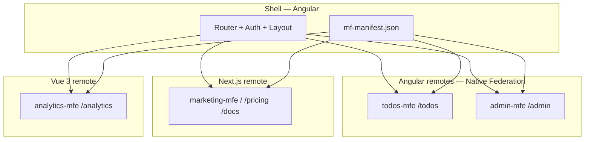

# Polyglot Microfrontends — архитектура (4 remotes)

> **Практика:** [phase-09-microfrontends.md](./phase-09-microfrontends.md)  
> **Multi-stack:** Angular + React/Next + Vue — см. [multi-stack-roadmap.md](./multi-stack-roadmap.md)  
> **React/Next теория:** [guides/react-next-faang-theory.md](./guides/react-next-faang-theory.md)  
> **Vue теория:** [guides/vue-faang-theory.md](./guides/vue-faang-theory.md)

**Принцип:** как GraphQL/gRPC — не «в конце», а **в момент Phase 9** после Angular SSR/build (Phase 7–8). Подготовка React/Vue идёт параллельно с Angular фазами 2–7.

---

## Карта приложений



| Remote | Stack | Route | Фича | Полная реализация |
|--------|-------|-------|------|-------------------|
| **shell** | Angular 19 | layout, auth | Host, SessionService, manifest | Phase 9 |
| **todos-mfe** | Angular 19 | `/todos/*` | Todos, Kanban, NgRx | Phase 9 (из monolith) |
| **admin-mfe** | Angular 19 | `/admin/*` | Tenants, migrations | Phase 9 stub → **Phase 14** |
| **marketing-mfe** | **Next.js 15** | `/`, `/pricing`, `/docs` | SEO, landing, public share | Phase 9 + **Phase 7** SSR |
| **analytics-mfe** | **Vue 3 + Vite** | `/analytics` | Stats, charts, Web Vitals | Phase 9 + **Phase 5–6** |

**Итого:** 2 Angular + 1 Next + 1 Vue = **4 microfrontends** + 1 shell.

---

## Интеграция cross-framework

| Пара | Механизм | Почему |
|------|----------|--------|
| Shell ↔ Angular remotes | `@angular-architects/native-federation` | First-class Angular 17+ |
| Shell ↔ Next.js | **Route-level proxy** (dev) + **CDN path** (prod) **или** Module Federation 2 remote | Next App Router + MF — interview topic |
| Shell ↔ Vue | `@originjs/vite-plugin-federation` / MF2 expose `./App` | Vite + Vue standard |
| Auth все remotes | `libs/shared/auth-contract` — JWT, tenantId, events `auth:logout` | Единый Keycloak Phase 17 |
| API все remotes | `contracts/openapi.yaml` + `contracts/graphql/schema.graphql` | Contract-first |
| Design | `libs/shared/design-tokens` (CSS variables) | Visual consistency |

---

## Manifest (runtime)

**Файл:** `apps/shell/public/mf-manifest.json`

```json
{
  "todos": {
    "type": "angular",
    "remoteEntry": "https://cdn.example.com/todos/remoteEntry.json"
  },
  "admin": {
    "type": "angular",
    "remoteEntry": "https://cdn.example.com/admin/remoteEntry.json"
  },
  "marketing": {
    "type": "next",
    "baseUrl": "https://cdn.example.com/marketing"
  },
  "analytics": {
    "type": "vue",
    "remoteEntry": "https://cdn.example.com/analytics/remoteEntry.js"
  }
}
```

Blue-green (Phase 15): меняется только manifest URL per tenant.

---

## Monorepo layout

```
anular-ngrx-todo-auth/          # Nx workspace (host)
apps/
  shell/
  todos-mfe/
  admin-mfe/
  marketing-mfe/                # Next.js App Router
  analytics-mfe/                # Vue 3 + Vite
libs/
  shared/
    auth-contract/
    design-tokens/
    api-types/                  # OpenAPI types (shared TS)
contracts/                      # ../../contracts — sibling repo
plans/multi-stack-roadmap.md    # матрица Angular + React/Next + Vue по фазам
```

---

## Связь с фазами

| Фаза | Polyglot |
|------|----------|
| 5 | Vue spike: chart component → будущий analytics-mfe |
| 7 | Next.js SSR spike → marketing-mfe pages |
| 8 | Env/CSP для всех remotes |
| **9** | **Все 4 MFE + shell** |
| 11 | E2E Playwright cross-framework |
| 14 | admin-mfe full + tenant propagation |
| 15 | manifest blue/green |
| 16 | CDN deploy 4 remotes + shell |
| 13 / 13g | OpenAPI + GraphQL во всех стеках |

---

## Interview portfolio line

«Polyglot MFE platform: Angular shell + 2 Angular remotes + Next.js marketing + Vue analytics; shared auth contract, OpenAPI/GraphQL, independent CDN deploy.»
