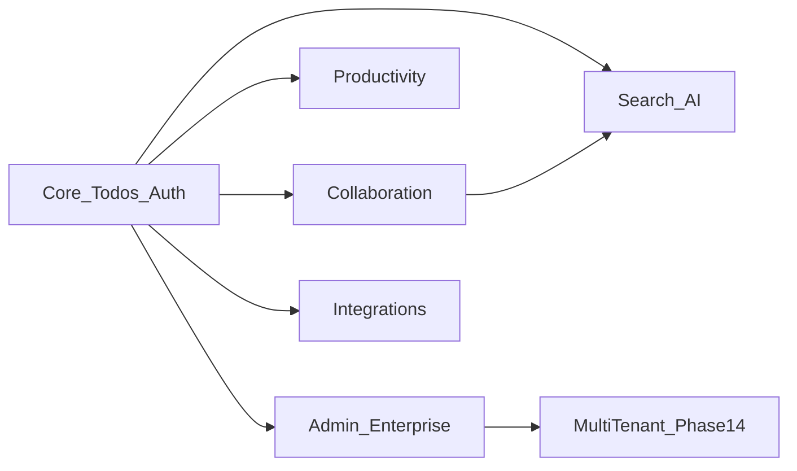
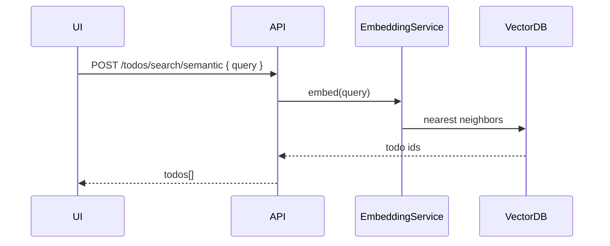

# Векторы расширения приложения (Product Features)

**Цель:** Превратить todo-auth из учебного CRUD в **портфолио-платформу** с фичами, которые показывают senior/FAANG-level навыки на собеседованиях.

**Как читать:** каждый **вектор** = набор фич. Фичи привязаны к **фазам roadmap** — внедряй по мере прохождения планов, не всё сразу.



---

## Матрица: фича → фаза → backend → навык

| # | Вектор | Фича | Frontend | Backend | Навык |
|---|--------|------|----------|---------|-------|
| V1 | Collaboration | Real-time sync | 4–5 | B-13 | WebSocket, SignalR |
| V1 | | Comments | 4 | B-03 | Nested state |
| V1 | | Share link | 7, **marketing-mfe (Next)** | B-02 | SSR public page |
| V2 | Search | Full-text | 5, 13 | B-15 | API design |
| V2 | | Vector search | 13+ | B-29 | Embeddings |
| V2 | | Saved views | 3 | B-10 | Read models |
| V3 | Productivity | Kanban | 6 | B-01, B-09 | Drag-drop + SQL |
| V3 | | Calendar | 6 | B-01 | i18n dates |
| V3 | | Recurring | 13 | B-03 | Cron API |
| V3 | | Tags/subtasks | 3–4 | B-03 | Entity trees |
| V4 | Admin | Admin dashboard | 14, **admin-mfe**, 17 | B-12, B-28 | CASL + CQRS |
| V4 | | Audit log | 14 | B-16 | Kafka stream |
| V4 | | User mgmt | 17 | B-05 | Keycloak admin |
| V5 | Integrations | Export | 5 | B-02 | Blob download |
| V5 | | Webhooks | 13 | B-07, B-16 | Event-driven |
| V5 | | OpenAPI consumer | 13 | B-02 | Contract-first |
| V6 | Analytics | Stats dashboard | 5, **analytics-mfe (Vue)** | B-10 | Charts + SQL |
| V6 | | Web Vitals | 12 | — | RUM frontend |
| V7 | Notifications | In-app | 3, 12 | B-07 | NgRx + RabbitMQ |
| V7 | | Push PWA | 12 | B-17 | Service Worker |
| V8 | Files | Attachments | 13 | B-14 | Presigned URL |
| V8 | | Image perf | 5 | — | NgOptimizedImage |
| V9 | AI | NL todos | 18 | B-29 | LLM API |
| V9 | | Smart priority | 18 | B-29 | Rules/ML |
| V9 | | Duplicate detect | 18 | B-29 | Vector similarity |
| V10 | Workspaces | Teams | 14 | B-11 | Multi-tenant |
| V10 | | Invite flow | 17 | B-05 | OIDC groups |
| V11 | **Protocols** | GraphQL Kanban/reads | **13-GraphQL** | **B-10** | Apollo, Hot Chocolate |
| V11 | | gRPC internal | 13-GraphQL (theory) | **B-17** | System design, .proto |
| V11 | | Polyglot MFE platform | **9** | — | 2× Angular + Next + Vue |
| V12 | **Multi-stack** | React/Next в каждой фазе | 0–18 | — | [multi-stack-roadmap.md](./multi-stack-roadmap.md) |
| V12 | | Vue 3 в каждой фазе | 0–18 | — | секции в phase-XX.md |

См. [integration-map.md](./integration-map.md)

---

# V1 — Collaboration & Real-time

**Когда:** Phase 4–5 (после facades + perf baseline)  
**Оценка:** 25–35 ч

## F1.1 WebSocket live todos

### Шаги

1. json-server не подходит — mock `ws://localhost:3001` Express + `ws` lib или Socket.io.
2. NgRx effect: `connectWebSocketOnLogin`, stream `TodoUpdated` events.
3. Reducer: `adapter.updateOne` на incoming events.
4. Показать «User X edited task» presence indicator (mock).

### Критерии

- [ ] Два браузера: edit в одном → видно в другом < 500ms
- [ ] Reconnect on disconnect with exponential backoff

### Career story

«Как бы спроектировал real-time для 1M users» → `docs/system-design/realtime-todos.md`

## F1.2 Comments thread

- Entity `Comment` linked to `todoId`.
- UI: collapsible thread, optimistic add.
- CASL: `can('comment', todo)` (Phase 17).

## F1.3 Public read-only share

- Route `/share/:token` — prerender + no auth.
- SSR meta для preview link.

---

# V2 — Search (full-text + vector)

**Когда:** Phase 5 (client) + Phase 13+ (backend)  
**Оценка:** 30–40 ч

## F2.1 Client-side search (старт)

- Signal `searchQuery`, `computed` filtered list.
- Highlight match в task text.
- Perf: debounce 300ms, Phase 5 virtual scroll совместимость.

## F2.2 Server full-text (Phase 13)

- API: `GET /todos/search?q=milk`
- Backend: Postgres `tsvector` или Typesense/Meilisearch (docker).
- NgRx: `searchTodos` action + separate `searchResults` slice.

## F2.3 Vector / semantic search (карьерный differentiator)

**Что это:** поиск по смыслу («продуктовый магазин» найдёт «buy groceries»).

### Архитектура (pet-project)



### Шаги (по порядку)

1. **Документ:** `docs/ai/vector-search-overview.md` — embeddings, cosine similarity, pgvector vs Pinecone.
2. **Docker:** Postgres + `pgvector` extension OR Qdrant local.
3. **При создании todo:** API генерирует embedding task text (OpenAI `text-embedding-3-small` или local `transformers.js` spike).
4. **UI:** поле «Smart search» + badge «semantic».
5. **NgRx:** `semanticSearchTodos` effect, отдельный loading state.
6. **Fallback:** если AI API down — обычный full-text.

### Минимальный UI

```html
<input placeholder="Search by meaning..." [formControl]="semanticQuery" />
@for (todo of semanticResults(); track todo.id) {
  <app-todo-item [todo]="todo" [similarity]="todo.score" />
}
```

### Критерии

- [ ] 10 seed todos — semantic query находит релевантные без точного слова
- [ ] ADR-013: why pgvector for pet project

### Навык

RAG, embeddings — частые темы 2024–2026 frontend/platform interviews.

---

# V3 — Productivity (Kanban, calendar, recurring)

**Когда:** Phase 3–6  
**Оценка:** 35–45 ч

## F3.1 Tags & priorities

- Расширить `Todo` model: `tags: string[]`, `priority: 'low'|'medium'|'high'`.
- Entity adapter + filters в SignalStore.
- DS: `TagChip`, color tokens per priority.

## F3.2 Subtasks

- `parentId` на todo — tree selector `selectTodoWithSubtasks`.
- UI: nested `@for` с indent.

## F3.3 Kanban board

- `@angular/cdk/drag-drop` между columns `todo | in-progress | done`.
- NgRx: `updateTodoStatus` optimistic.
- **Perf:** Phase 5 — только видимые columns virtualized.

## F3.4 Calendar + due dates

- `@angular/common` `DatePipe` + locale.
- Month view component (можно `angular-calendar` lib — 1 день evaluate).
- Overdue todos: computed `isOverdue`.

## F3.5 Recurring todos (Phase 13 API)

- RRULE в API (`FREQ=WEEKLY`).
- UI: repeat picker.
- Effect generates next instance on complete.

---

# V4 — Admin & Enterprise

**Когда:** Phase 14, 17  
**Оценка:** 25–35 ч

## F4.1 Admin dashboard

- Route `/admin` — `canMatch` + CASL `manage all`.
- Widgets: user count, todos created today (mock API).

## F4.2 Audit log

- NgRx `audit` entity: `{ id, actor, action, resource, timestamp }`.
- UI: infinite scroll table, filter by actor.
- **Не editable** — read-only stream.

## F4.3 Keycloak user admin (read-only)

- keycloak admin REST API spike: list users in tenant.
- Token service account — document only in dev.

---

# V5 — Integrations & Export

**Когда:** Phase 5, 13  
**Оценка:** 15–20 ч

## F5.1 Export

- `exportTodos(format: 'csv' | 'json')` — generate client-side Blob.
- Large export: API streaming (Phase 13).

## F5.2 Webhooks

- UI: register webhook URL, events `todo.created`.
- Mock delivery log in json-server custom route.

## F5.3 API playground

- Page `/developers` — try API with your token (Swagger UI embed).

---

# V6 — Analytics & Insights

**Когда:** Phase 5–6, 12  
**Оценка:** 20–25 ч

## F6.1 Stats dashboard

- Chart.js или ngx-charts: completed per week, by tag.
- Data from selector `selectTodoStats` (memoized).

## F6.2 Personal goals

- «Complete 10 todos this week» — progress ring (DS component).

---

# V7 — Notifications

**Когда:** Phase 3, 12  
**Оценка:** 15–20 ч

## F7.1 Notification center

- Entity `Notification` in NgRx.
- Bell icon + dropdown, mark as read.
- Effect: todo assigned → notification (mock).

## F7.2 PWA Push (Phase 12)

- `ng add @angular/pwa` + push subscription mock.

---

# V8 — File attachments

**Когда:** Phase 13  
**Оценка:** 20–25 ч

- Upload flow: presigned URL pattern (document even if S3 mock).
- Progress bar, cancel upload.
- CASL: `can('attach', todo)`.

---

# V9 — AI Assistant

**Когда:** Phase 18 (новая) — после Phase 13 API  
**Оценка:** 30–40 ч  
**Файл деталей:** [phase-18-ai-features.md](./phase-18-ai-features.md)

Кратко:

- NL create todo («завтра в 10 созвон») → parse → `addTodo`.
- Smart tags suggestion.
- Semantic dedup (связь с V2.3).

---

# V10 — Workspaces & Teams

**Когда:** Phase 14 multi-tenant  
**Оценка:** 25–35 ч

- Sidebar: switch workspace.
- Todos scoped `workspaceId`.
- Invite flow mock email.

---

## Рекомендуемый порядок внедрения (карьерный максимум)

| Порядок | Фичи | Почему |
|---------|------|--------|
| 1 | Tags, priorities, subtasks | Углубляет NgRx Entity |
| 2 | Kanban + calendar | Сложный UI, видно в портфолио |
| 3 | CASL + admin (Phase 17) | Enterprise authz |
| 4 | WebSocket real-time | System design |
| 5 | Full-text search | API + perf |
| 6 | Vector search + AI (Phase 18) | Современный стек |
| 7 | Audit + workspaces | Multi-tenant story |

---

## Обновления существующих phase-планов

Добавлены перекрёстные ссылки — при прохождении фазы смотри таблицу выше:

- **Phase 3:** tags, subtasks, notifications entity
- **Phase 4:** comments, WebSocket prep
- **Phase 5:** search debounce, stats dashboard, export
- **Phase 6:** Kanban, calendar, tag chips
- **Phase 12:** push notifications
- **Phase 13:** full-text + attachments API
- **Phase 14:** workspaces
- **Phase 17:** admin, CASL per feature

---

## Портфолио README (итоговый вид)

```markdown
## Features
- OIDC + Keycloak SSO, CASL RBAC
- Real-time todos (WebSocket)
- Kanban, calendar, recurring
- Semantic vector search (pgvector)
- AI natural language todo creation
- Multi-tenant workspaces
- PWA + Electron offline
- Polyglot microfrontends (2× Angular + Next.js + Vue 3) — [multi-stack-roadmap.md](./multi-stack-roadmap.md)
```

---

## Следующий файл

→ [phase-18-ai-features.md](./phase-18-ai-features.md) — детальный план AI/vector фич
